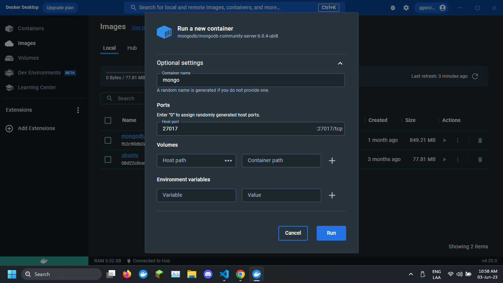
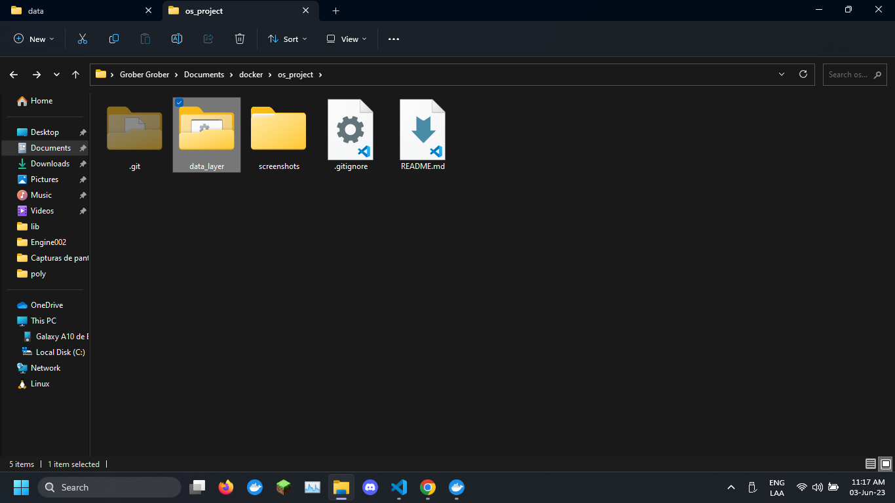
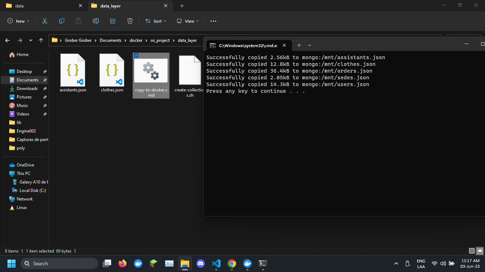
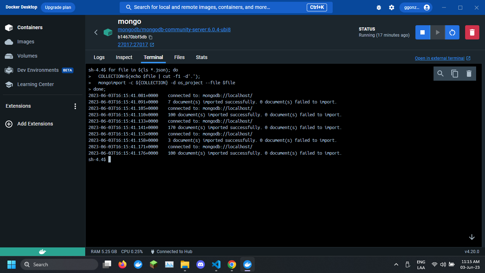

# Os Project


## Data Layer

Run the docker image for Data Layer

### Linux Setup

```sh
cd data_layer
sh start-docker.sh
docker exec -it mongo sh
```

Inside Mongo Container

```sh
cd /mnt
sh create-collections.sh
```

### Windows Setup

Create the container


Download Project


Run Script `copy-to-docker.cmd`


Run next Code in the container terminal
```sh
cd /mnt
for file in $(ls *.json); do
  COLLECTION=$(echo $file | cut -f1 -d'.');
  mongoimport -c ${COLLECTION} -d os_project --file $file
done;
```


## Use Mongosh

Inside Cotainer Run

```sh
mongosh os_project
```