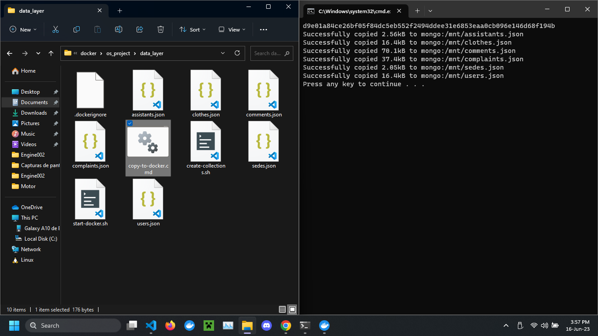
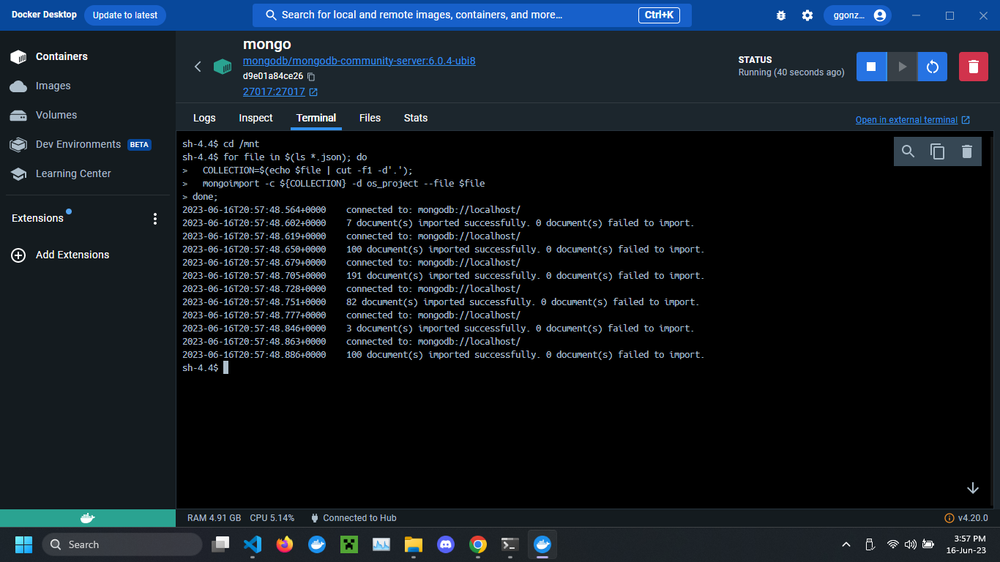
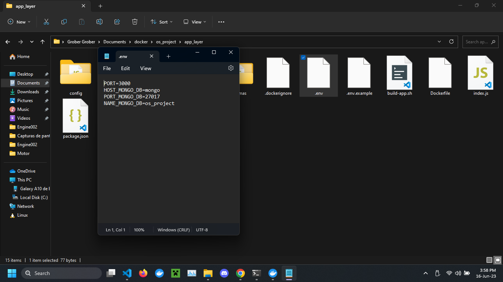
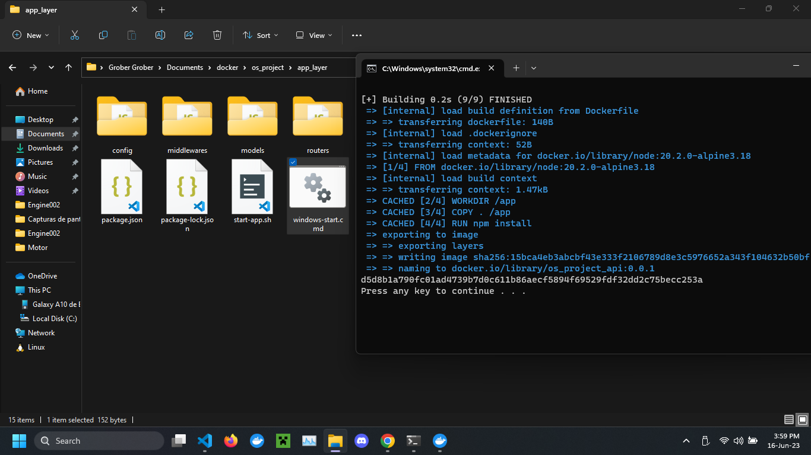
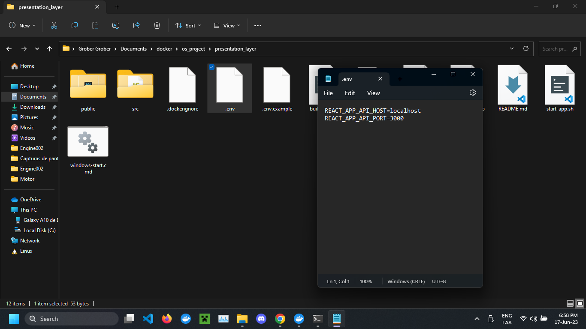
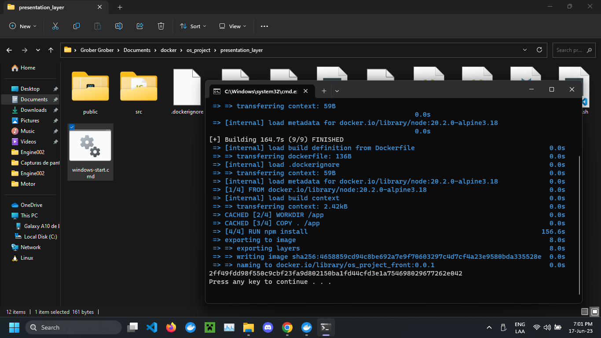
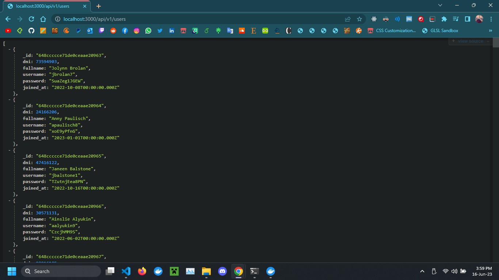
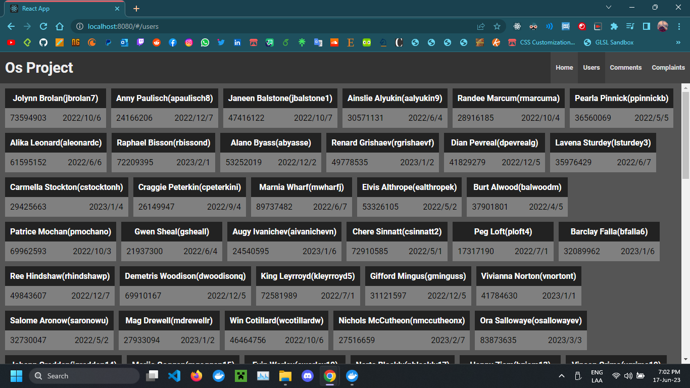

# Os Project

### Network configuration

Execute the following command to check if you have the network created.

```sh
docker network ls
```

```
NETWORK ID     NAME        DRIVER    SCOPE
2170fe35ccd8   bridge      bridge    local
052821d2d427   dockernet   bridge    local
83976fd40b77   host        host      local
3cfb773db75e   none        null      local
```
If you don't have `docketnet` execute the following command.

```sh
docker network create --attachable dockernet
```

## Data Layer

Download the project and execute `copy-to-docker.cmd` inside of `data_layer` folder.


Then execute the following command in the container terminal.
```sh
cd /mnt
for file in $(ls *.json); do
  COLLECTION=$(echo $file | cut -f1 -d'.');
  mongoimport -c ${COLLECTION} -d os_project --file $file
done;
```


## App Layer

inside `app_layer` folder create a file with the name `.env` with the following content.

```sh
PORT=3000
HOST_MONGO_DB=mongo
PORT_MONGO_DB=27017
NAME_MONGO_DB=os_project
```


The exectute `windows-start.cmd`
This could take some minutes.



## Presentation Layer

inside `presentation_layer` folder create a file with the name `.env` with the following content.

```sh
REACT_APP_API_HOST=localhost
REACT_APP_API_PORT=3000
```


The exectute `windows-start.cmd`
This could take some minutes.



## Screenshot



You can try with differente request

```sh
http://localhost:3000/api/v1/users
http://localhost:3000/api/v1/comments
http://localhost:3000/api/v1/complaints
http://localhost:3000/api/v1/clothes
http://localhost:3000/api/v1/sedes
```